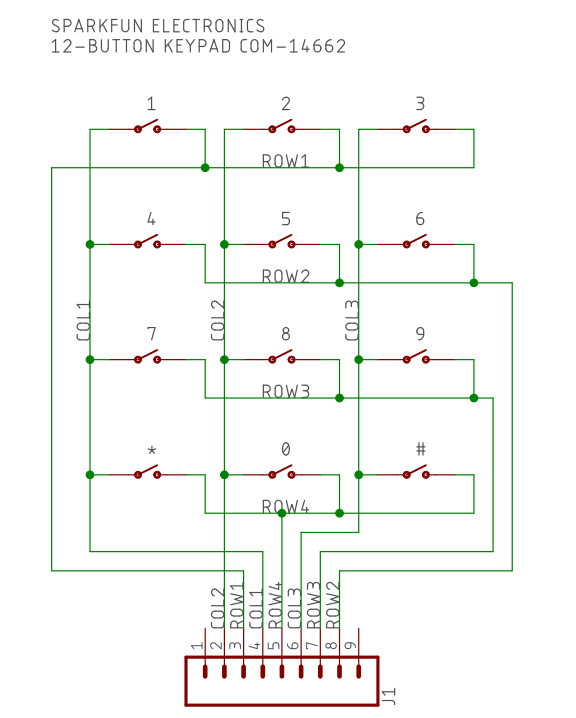

# Build Instructions for Second Factor Keypad

## Table of Contents
1. [Introduction](#introduction)
2. [Bill of Materials](#bill-of-materials)
3. [Arduino IDE Configuration](#arduino-ide-configuration)
4. [Soldering and Assembly](#soldering-and-assembly)
5. [Serial Connection](#serial-connection)
6. [Power Up](#power-up)
7. [Testing](#testing)

### Introduction
The 12-Button Matrix Keypad uses a matrix of switches to track which column and row a pressed button is in. The development platform used to read the column/row outputs and drive the state for the lights and buzzer is the Nucleo L432KC. It comes equipped with an onboard ST-LINK v2 and is Arduino IDE compatible.

### Bill of Materials
(All Prices pre-tax and in CAD)

*  Nucleo L432KC STM32 Development Board - $15.176
*  COM-14662 12-Button Matrix Keypad - $6.87
*  Red LED - $0.86
*  Green LED - $0.83
*  Piezzo Speaker - $1.04

### Arduino IDE Configuration && installing Source Code
1) The Arduino IDE can be downloaded for free from https://www.arduino.cc/en/main/software and is available for Windows, Mac OS X and Linux.
2) Open Arduino IDE and click Files and then preference.
3) Add the stm32duino board manager repository by entering 'https://raw.githubusercontent.com/stm32duino/BoardManagerFiles/master/STM32/package_stm_index.json' in to 'Additional Boards Manager URLs' and click OK.
4) Plug the micro usb from the Nucleo in to the computer.
5) Click on Tools > Board > Boards Manager and install STM32 Core from the list.
6) Click Tools > Board and select Nucleo-32 and then click Tools > Board Part Number and select Nucleo L432KC.
6) Click Tool > Port and select the port the board is connected to.
7) Install the Keypad.h library by downloading keypad.zip from https://playground.arduino.cc/Code/Keypad/ and install it by clicking Sketch > Include Library > ADD .zip file and select keypad.zip file you downloaded.
7) Download/Copy the source code from https://github.com/c3ko/SecondFactorKeypad/blob/master/software/blink_example1.ino
8) Click Sketch > Upload and then Tools > Serial Monitor to see serial output. Make sure Tools > 
Upload Method is set to STM32CubeProgrammer(SWD).

### Soldering and Assembly
Use the following image as guide for correct position of board on to sockets:

The PCB Gerber files used for printing the board can be found at https://github.com/c3ko/SecondFactorKeypad/blob/master/mechanical/MohamedKore_SecondFactorKeypadV3.zip
##### Keypad Pins
* Solder Pins on to the Keypad.

#### PCB Pins

* Solder 7-pin single-line header socket on to board
* Solder 2 15-pin single line header sockets on to board
* Solder 3 330 ohm Resistors on to board at output pins for D10, D11, D12

* Solder Piezzo speaker and LED in to their positions based on pCB image above
 

  
#### Enclosure
Enclosure can be produced using laser cutting of Acrylic. File for cutting can be found at:
https://github.com/c3ko/SecondFactorKeypad/blob/master/MohamedKoreBoxCase.cdr

Use a peice of styrofoam or hard plastic cut to 17mm height 53mm width, 53mm  length to be placed under cantilevered keypad as support.

### Power Up
When PCB hand connected components are inside the enclosure. Plug the Nucleo-32 in to computer using micro-USB outlet on side of enclosure.
### Testing

#### Unit Testing

After soldering the pins on to the keypad. Use a multimeter to measure resistance between the corresponding Row/Column pin for each button. The resistance should drop when button is pressed:

Test each of the LEDs and the piezzo speaker by setting their digital outputs in the Arduino IDE to high and uploading that sketch to the Nucleo-32.

#### Production Testing

### Reproducability
The project is easily reproducable as all of the components (resistors, keypad, led etc.) are well stocked at major electronic parts suppliers (Digi-key & Mouser). The development environment works on all major operating systems and all of the code has been provided.

### Reference

1.https://circuitdigest.com/microcontroller-projects/getting-started-with-stm32-development-board-stm32f103c8-using-arduino-ide

2. https://playground.arduino.cc/Code/Keypad/
