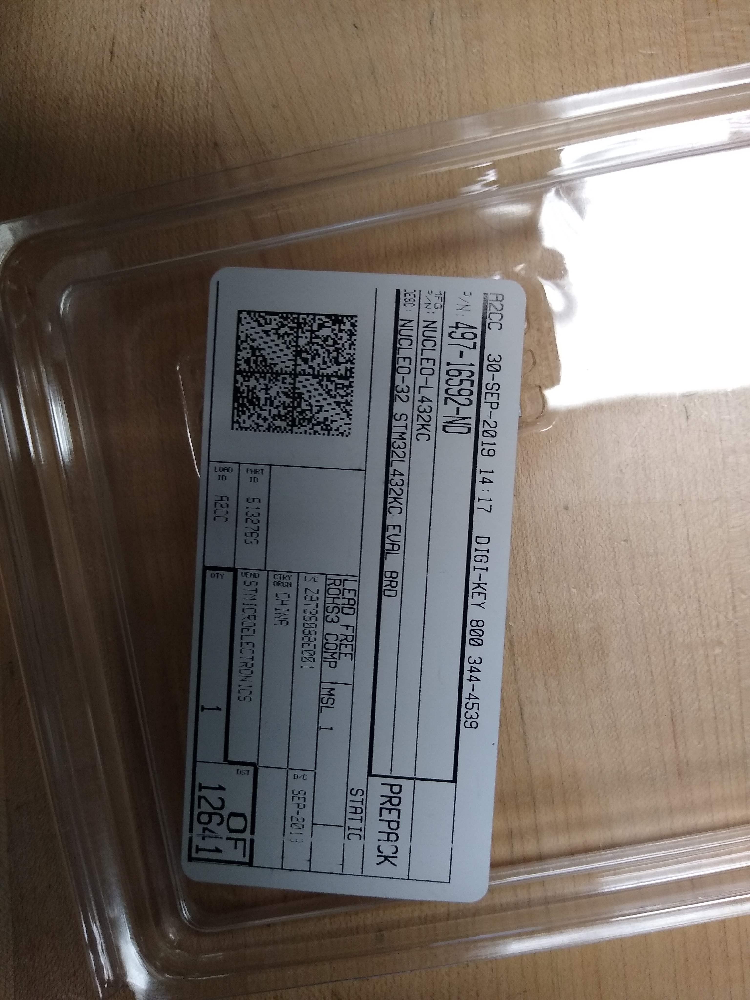
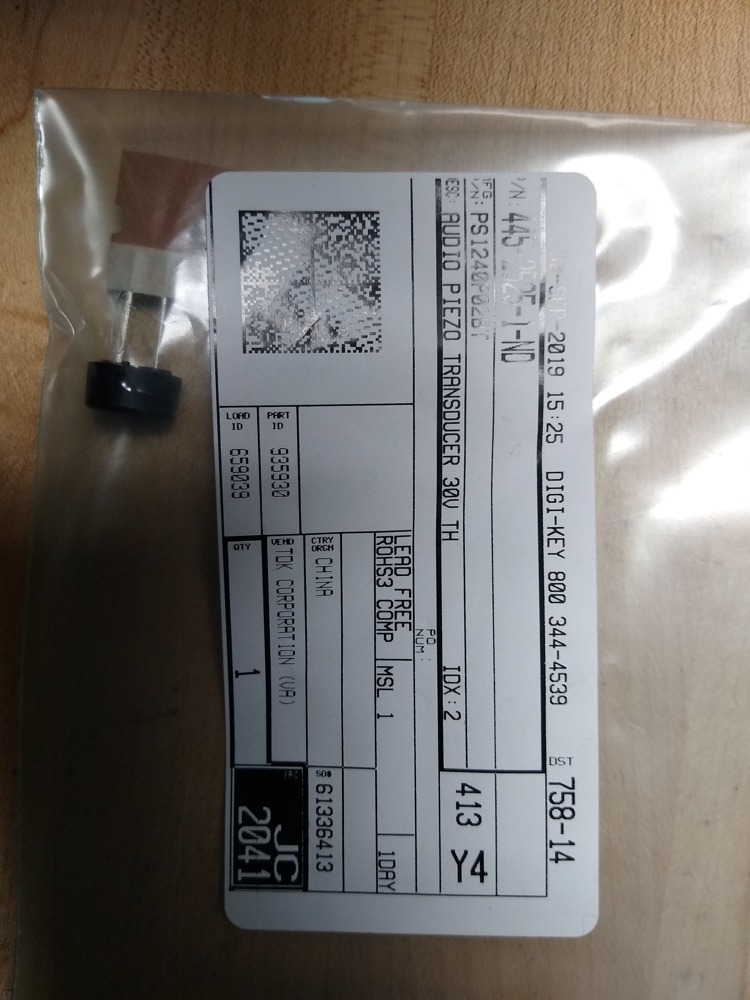
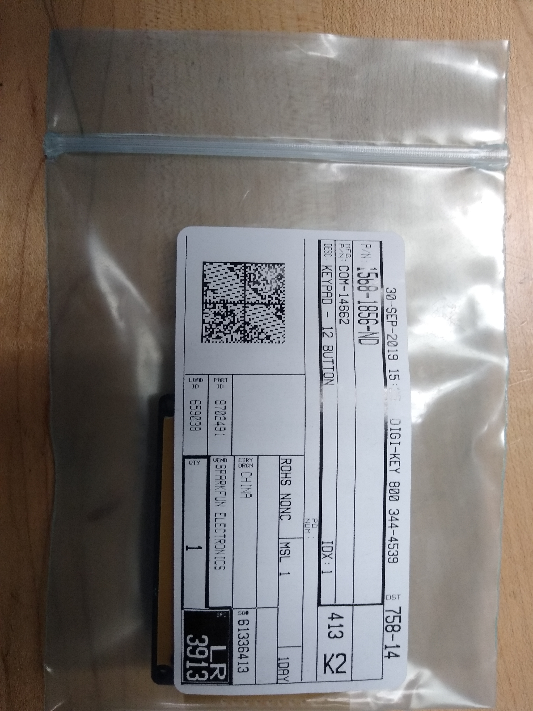
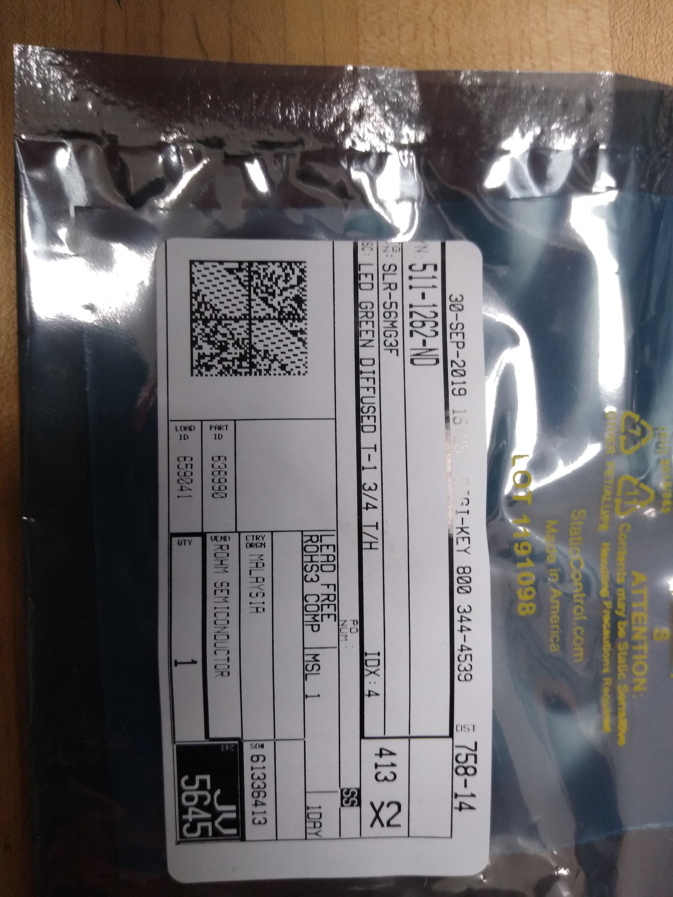
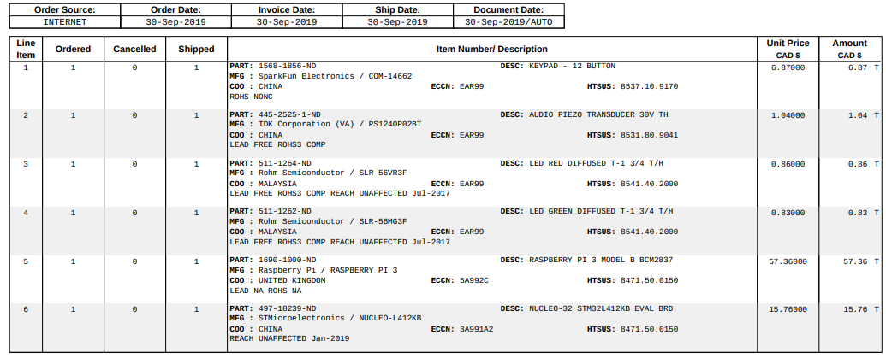
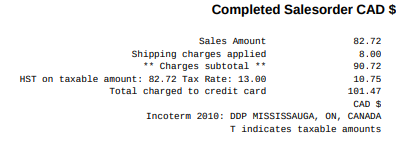
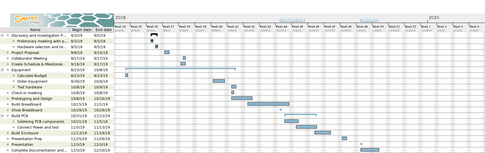

<h2>October 8, 2019</h2>
<h3>Proof of Acquisition</h3>

All parts arrived together on Tuesday, October 1, 2019

<h2>October 1, 2019</h2>

The parts have been ordered and should arrive by October 1st.

The total for the budget has changed as I've decided to use the NUCLEO-L412KB using mbed. This was due to the order for the blue pill being cancelled and prime shipping was no longer available.

<h2>September 24th, 2019</h2>
<h3>Budget Summary</h3>

Sub-Total: $86.84 CAD

Taxes: $11.29 CAD

Shipping: $8.00 CAD

Total: $106.13

Full Budget breakdown can be found Here:
<a href="documentation/Budget.xlsx">Budget Spreadsheet</a>

<h2>September 17th, 2019</h2>

Gantt Chart and Schedule Overview:

<h2>September 10th, 2019</h2>

For my hardware project, I've decided to implement a two-factor authentication system using a Keypad.

This project will require at minimum:
<ul>
  <li>COM-14662 12-Button Keypad</li>
  <li>STM32f103c8t6 board</li>
  <li>LED lights</li>
  <li>Speaker</li>
</ul>

<h2>September 9th, 2019</h2>

Repository Created!

