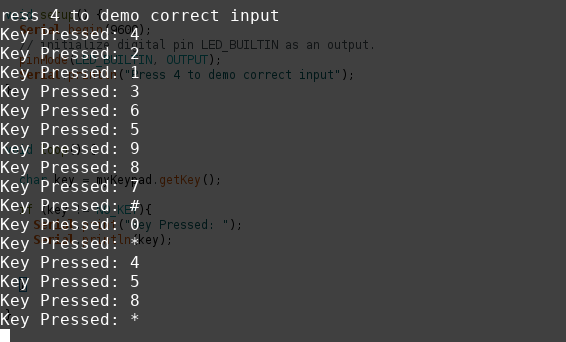

<h2>November 26, 2019</h2>

<h3>Presentation</h3>

Presentation slides have been completed and can be found under the <a href="documentation/">documentation folder</a>

<h2>November 19, 2019</h2>

<h3>Enclosure Progress</h3>

The snap-fit enclosure case for the keypad will have a support cross-section for the keypad to rest on as its current cantilevered position will damage the sockets/pins when pressure is applied to the buttons.

The files can be found at:

<a href="mechanical/KeyPadEnclosure_bottom.stl">Bottom part of Enclosure STL</a>

<a href="mechanical/KeyPadEnclosure_top.stl">Top part of Enclosure STL</a>

Update: As of November 26, 2019. The enclosure has finished printing but is currently in solution to remove the support material. The tentative date for completion is November 27, 2019.

<h2>November 11, 2019</h2>

<h3>PCB Powered On</h3>
The 12-Button Keypad uses a grid with switches were connections are closed and a lower resistance allows 5V to pass through. This method for reading key presses doesn't require seperate pins for power and ground so powering up this PCB is as simple as plugging in the the input pins into the socket on the PCB connecting it to the inputs A0-A8 on the Nucleo-32.

As the images below show. The PCB is powered on and is communicating key presses serially to a terminal:

<h2>November 5, 2019</h2>

<h3>PCB Soldered </h3>

The first soldering of headers on the PCB was done on the wrong side of the board. I managed to desolder the headers and solder them back on the component side of the board. There is continuity between the headers and the development board and keypad work as they did on the breadboard: 

While the original PCB was designed with LED's and a Piezzo Buzzer in mind, I've decided to forego them as their functionality (notifiying a user of a correct or incorrect input) can be more easily implmented using Raspberry Pi which will be connected using the USB port on the Nucleo-32. 

Besides that, the project is on schedule and no new parts were required.

<h2>October 29, 2019</h2>

<h3>Update </h3>
It turns out that when I had straightened the header on the keypad, the contact between the solder and the copper surface flexed, taking the copper surface pads off the keypad with the exception of pins 8 and 4, which are for row 2 and column 1 respectively. This is likely why 4 was the only button working on the keypad. 

I ordered and received another keypad:

This added an additional $15.75 to the budget (includeing shipping).

The new keypad works perfectly. Screenshots of the output and the code used. 

The code was sourced from a tutorial example at: <a href="http://robojax.com/learn/arduino/?vid=robojax-keypad-4x3">Robojax 4x3 Keypad Example</a>

My code file can be found at: <a href="software/blink_example1.ino">sotfware/blink_example1.ino</a>

<h3>Breadboard Milestone</h3>
Soldered Header pins on to the Keypad. Red light and three buzzes when when entered number doesn't match hardcoded value. Green light and single alarm when correct.

The Keypad appears to be defective. When running the only number that produces an output is 4. Also, when measuring the resistance between the corresponding col and row pins for each number, there is an open circuit with the exception of 4.

The rest of the components on the breadboard are working fine and I've ordered another keypad from Digikey to replace the defective one.

<h2>October 15, 2019</h2>

<h3>Updated Fritzing Designs</h3>

<h3>Fritzing Designs</h3>

These designs are temporary as I'm using a Nucleo-32 instead of the STM32 blue pill board. I'm in the process of making designs with custom header pins based on the Nucleo L432KC in Fritzing

<h2>October 8, 2019</h2>
<h3>Proof of Acquisition</h3>

All parts arrived together on Tuesday, October 1, 2019

The Green and Red LED lights are for prototyping on the breadboard. The Nucleo L432KC has a built in debugger and is compatible with Arduino IDE. This week I'll setup the Arduino IDE environment to work with the board. 

<h2>October 1, 2019</h2>

The parts have been ordered and should arrive by October 1st.

The total for the budget has changed as I've decided to use the NUCLEO-L412KB using mbed. This was due to the order for the blue pill being cancelled and prime shipping was no longer available.

<h2>September 24th, 2019</h2>
<h3>Budget Summary</h3>

Sub-Total: $86.84 CAD

Taxes: $11.29 CAD

Shipping: $8.00 CAD

Total: $106.13

Full Budget breakdown can be found Here:
<a href="documentation/Budget.xlsx">Budget Spreadsheet</a>

<h2>September 17th, 2019</h2>

Gantt Chart and Schedule Overview:

<h2>September 10th, 2019</h2>

For my hardware project, I've decided to implement a two-factor authentication system using a Keypad.

This project will require at minimum:
<ul>
  <li>COM-14662 12-Button Keypad</li>
  <li>STM32f103c8t6 board</li>
  <li>LED lights</li>
  <li>Speaker</li>
</ul>

<h2>September 9th, 2019</h2>

Repository Created!

